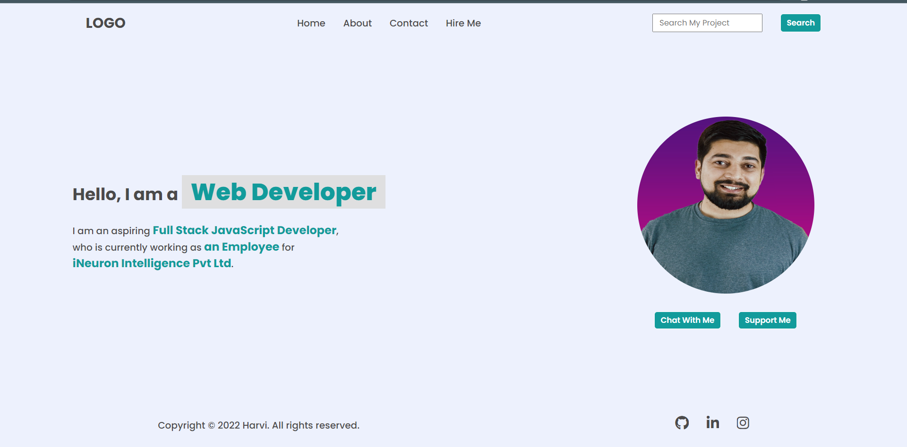

# _DOM Assignment - 1_

___
### _After Update Final Output_ :



## _Task 1_:

### **Solution :**
```JavaScript
let element = document.createElement("li");
element.innerHTML= "<a>Hire Me</a>" ;
'<a>Hire Me</a>'
let parent = document.querySelector("header nav ul");
parent.appendChild(element); 
```


## _Task 2_:

### **Solution :**
```JavaScript
let s= document.querySelector(".search-field input")
s.placeholder='Search My Project' ;
```


## _Task 3_:

### **Solution :**
```JavaScript
let x = document.querySelectorAll(".hero-left-section p span");
x[1].innerText= 'an Employee' ;
x[2].innerText= 'iNeuron Intelligence Pvt Ltd' ;
```


## _Task 4_:

### **Solution :**
```JavaScript
let y= document.querySelector(".hero-right-section img");
y.src="https://hiteshchoudhary.com/static/a8d73d1aac4c79e9bb689640e6090367/2eaab/person-image.jpg";
```

## _Task 5_:

### **Solution :**
```JavaScript
let par =document.querySelector(".hero-right-section-btns");
let bt= document.createElement("button");
bt.innerText='Support Me';
par.appendChild(bt);
```
